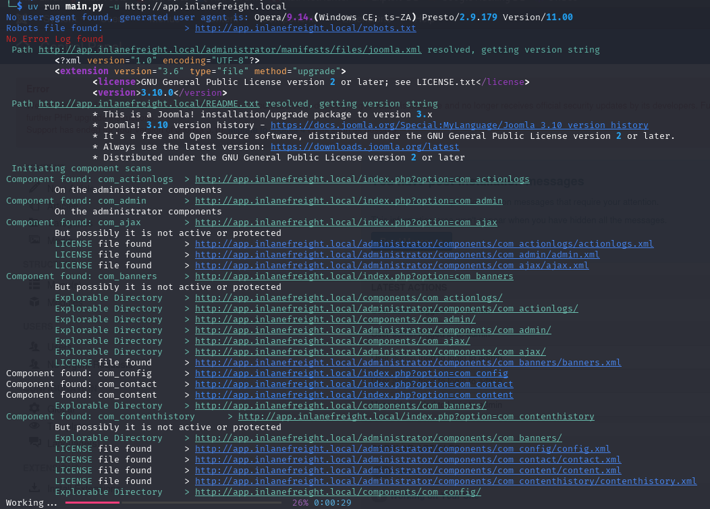

# Joomla Scan
A free and open source software to find the components installed in Joomla CMS, built out of the ashes of Joomscan and Joomla Scan. This project is a fork of Joomla Scan by drego85 on github. It was modernized and improved considerably.

# Features
* Scanning the Joomla CMS sites in search of components/extensions (database of more than 600 components);
* Locate the browsable folders of component (Index of ...);
* Locate the components disabled or protected
* Locate each file useful to identify the version of a components (Readme, Manifest, License, Changelog)
* Locate the robots.txt file or error_log file
* Supports HTTP or HTTPS connections
* Connection timeout

# Next Features
* Customized User Agent and Random Agent
* The user can change the connection timeout
* A database of vulnerable components

# Usage
```
 Usage: main.py [OPTIONS]

╭─ Options ──────────────────────────────────────────────────────────────────────────────╮
│ *  --url                 -u      TEXT     The Joomla URL to scan. [default: None]      │
│                                           [required]                                   │
│    --threads             -t      INTEGER  Number of threads to use. [default: 10]      │
│    --user-agent          -a      TEXT     The user agent to use. [default: None]       │
│    --timeout             -T      INTEGER  The timeout before moving on with an http    │
│                                           request to joomla.                           │
│                                           [default: 5]                                 │
│    --install-completion                   Install completion for the current shell.    │
│    --show-completion                      Show completion for the current shell, to    │
│                                           copy it or customize the installation.       │
│    --help                                 Show this message and exit.                  │
╰────────────────────────────────────────────────────────────────────────────────────────╯
```

# Screenshot



# Requirements
We *strongly* recommend using `uv` as it is fast and more modern. It'll automatically resolve the dependencies for you.
* Python
* beautifulsoup4

# Changelog
* 2025.15.05 0.6beta > Bring the codebase to python3, remove the broken check call in the index path. Revive from the dead.
* 2016.12.12 0.5beta > Implementation of the Multi Thread, Updated database from 656 to 686 components, Fix Cosmetics and Minor Fix.
* 2016.05.20 0.4beta > Find README.md, Find Manifes.xml, Find Index file of Components (Only if descriptive), User Agent and TimeOut on Python Request, Updated database from 587 to 656 components, Fix Cosmetics and Minor Fix.
* 2016.03.18 0.3beta > Find index file on components directory
* 2016.03.14 0.2beta > Find administrator components and file Readme, Changelog, License.
* 2016.02.12 0.1beta > Initial release

# License
GNU, version 3


*This work has been sponsored by [Sythe Labs](https://sythelabs.com).*